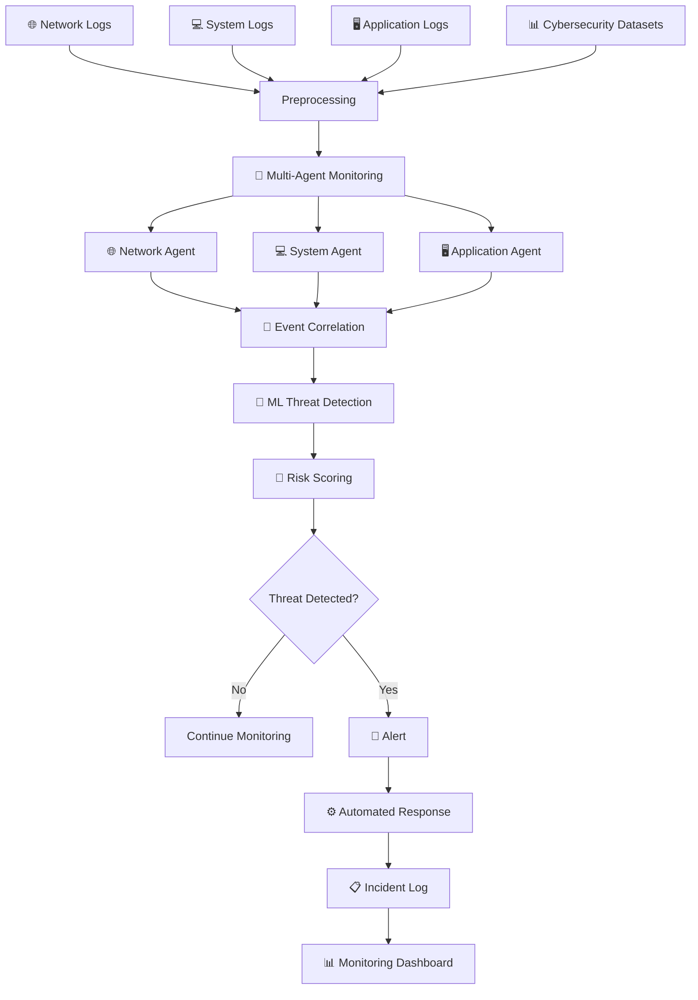
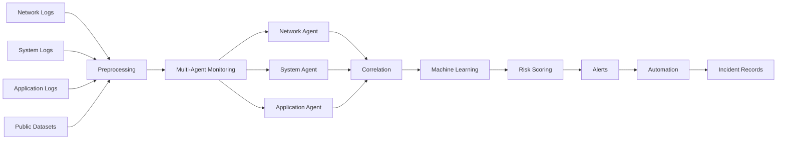

# 🛡️ AI-DRIVEN MULTI-AGENT SYSTEM FOR CYBER THREAT DETECTION

<p align="center">
  <strong>From Raw Logs → Intelligent Correlation → Threat Detection → Automated Response</strong>
</p>

<p align="center">
  A multi-agent cybersecurity monitoring architecture that brings together network, system, and application intelligence to identify suspicious activity and prioritize threats.
</p>

<p align="center">


</p>

---

## 🚨 THE PROBLEM

Modern cyberattacks rarely appear as one isolated event.

An attacker may:

```text
Failed Login Attempts
        ↓
Suspicious User Activity
        ↓
Privilege Escalation
        ↓
Abnormal Network Traffic
        ↓
Unauthorized Application Access
        ↓
     🚨 ATTACK
```

The challenge is that these events can originate from completely different sources.

Traditional monitoring approaches may inspect network traffic, system logs, or application activity separately.

This project explores a unified approach:

> **Let specialized AI agents observe different security layers, then correlate their observations to understand the larger attack story.**

---

# 🧠 PROJECT CONCEPT

The **AI-Driven Multi-Agent System for Cyber Threat Detection** integrates:

- 🌐 Network security logs
- 💻 System activity logs
- 🖥️ Application / web-server logs
- 📊 Public cybersecurity datasets
- 🤖 Machine-learning-based threat detection
- 🔗 Cross-source event correlation
- ⚠️ Risk-based prioritization
- 🔔 Alert generation
- ⚙️ Automated response workflows

The architecture is designed around multiple specialized monitoring agents rather than relying on a single detection component.

---

# ⚡ CORE IDEA

```text
┌───────────────────────────────────────────────────────────────┐
│                    CYBER ENVIRONMENT                          │
└───────────────────────────────────────────────────────────────┘
                              │
             ┌────────────────┼────────────────┐
             ↓                ↓                ↓
      🌐 NETWORK         💻 SYSTEM       🖥️ APPLICATION
         LOGS              LOGS               LOGS
             │                │                │
             ↓                ↓                ↓
      ┌────────────┐   ┌────────────┐   ┌────────────┐
      │  NETWORK   │   │   SYSTEM   │   │ APPLICATION│
      │   AGENT    │   │   AGENT    │   │    AGENT   │
      └─────┬──────┘   └─────┬──────┘   └─────┬──────┘
            │                 │                 │
            └─────────────────┼─────────────────┘
                              ↓
                    🔗 EVENT CORRELATION
                              ↓
                    🤖 ML THREAT DETECTION
                              ↓
                       🎯 RISK SCORING
                              ↓
                    🚨 ALERT GENERATION
                              ↓
                    ⚙️ AUTOMATED RESPONSE
                              ↓
                    📋 INCIDENT RECORD
```

---

# 🏗️ SYSTEM ARCHITECTURE



---

# 🎯 PROJECT OBJECTIVES

### 01 — LOG COLLECTION

Collect security information from:

- Network environments
- Operating systems
- Applications
- Web servers
- Public cybersecurity datasets

### 02 — EVENT CORRELATION

Connect events from different sources to identify relationships that may indicate an attack.

### 03 — INTELLIGENT DETECTION

Use lightweight machine-learning approaches for suspicious activity and anomaly detection.

### 04 — MULTI-AGENT MONITORING

Assign specialized monitoring responsibilities to independent agents.

### 05 — RISK PRIORITIZATION

Evaluate detected activity using:

```text
Severity
   +
Impact
   +
Probability
   ↓
Risk Priority
```

### 06 — ALERT & RESPONSE

Generate alerts and connect detected threats with automated workflows.

---

# 🤖 THE THREE SECURITY AGENTS

## 🌐 NETWORK AGENT

Monitors network-level activity.

### Detects / observes:

- Suspicious packets
- Abnormal traffic
- Intrusion attempts
- Port scans
- Network anomalies

```text
NETWORK TRAFFIC
       ↓
   NETWORK AGENT
       ↓
Suspicious Activity?
       ↓
   Correlation
```

---

## 💻 SYSTEM AGENT

Monitors host and operating-system activity.

### Observes:

- Login attempts
- Repeated failed authentication
- Privilege escalation
- CPU anomalies
- Suspicious host activity

```text
SYSTEM EVENTS
      ↓
 SYSTEM AGENT
      ↓
Host Behaviour
      ↓
Correlation Engine
```

---

## 🖥️ APPLICATION AGENT

Monitors application and web-server behaviour.

### Observes:

- Unauthorized access
- Web attacks
- API misuse
- Abnormal user behaviour
- Application-level anomalies

```text
APPLICATION LOGS
       ↓
 APPLICATION AGENT
       ↓
Behaviour Analysis
       ↓
Correlation Engine
```

---

# 🔗 WHY EVENT CORRELATION MATTERS

A single event may look harmless.

Multiple related events can tell a completely different story.

### Example Attack Chain

```text
┌───────────────────────────────┐
│ 1. Multiple Failed Logins     │
└───────────────┬───────────────┘
                ↓
┌───────────────────────────────┐
│ 2. Successful Authentication  │
└───────────────┬───────────────┘
                ↓
┌───────────────────────────────┐
│ 3. Privilege Escalation       │
└───────────────┬───────────────┘
                ↓
┌───────────────────────────────┐
│ 4. Abnormal Network Activity  │
└───────────────┬───────────────┘
                ↓
        🚨 HIGH-RISK CHAIN
```

Instead of evaluating each event independently, the system correlates events across monitoring layers.

---

# 🧬 THREAT DETECTION PIPELINE

```text
                    RAW SECURITY DATA
                           │
                           ▼
                 ┌──────────────────┐
                 │  LOG COLLECTION  │
                 └────────┬─────────┘
                          ▼
                 ┌──────────────────┐
                 │ PREPROCESSING    │
                 └────────┬─────────┘
                          ▼
             ┌─────────────────────────┐
             │   MULTI-AGENT LAYER     │
             ├─────────────────────────┤
             │ Network │ System │ App  │
             └────────────┬────────────┘
                          ▼
                 ┌──────────────────┐
                 │ EVENT CORRELATION│
                 └────────┬─────────┘
                          ▼
                 ┌──────────────────┐
                 │ ML THREAT        │
                 │ DETECTION        │
                 └────────┬─────────┘
                          ▼
                 ┌──────────────────┐
                 │   RISK SCORING   │
                 └────────┬─────────┘
                          ▼
                 ┌──────────────────┐
                 │ ALERT GENERATION │
                 └────────┬─────────┘
                          ▼
                 ┌──────────────────┐
                 │ AUTOMATED        │
                 │ RESPONSE         │
                 └────────┬─────────┘
                          ▼
                 ┌──────────────────┐
                 │ INCIDENT RECORD  │
                 └──────────────────┘
```

---

# 🤖 MACHINE LEARNING LAYER

The threat-detection layer is designed around lightweight machine-learning techniques.

The project report identifies approaches such as:

- **Random Forest**
- **Isolation Forest**

These can support:

```text
Normal Behaviour
       ↓
Feature Extraction
       ↓
ML Analysis
       ↓
Anomaly / Suspicious Activity
       ↓
Threat Classification / Prioritization
```

The architecture emphasizes lightweight models so that the detection layer can remain practical for continuous monitoring.

---

# 🎯 RISK SCORING

Detected events can be prioritized according to:

| Factor | Meaning |
|---|---|
| Severity | How serious is the detected activity? |
| Impact | What could be affected? |
| Probability | How likely is the activity to represent a threat? |

Conceptually:

```text
              SEVERITY
                  │
                  ▼
IMPACT ───────► RISK ◄────── PROBABILITY
                  │
                  ▼
           PRIORITY LEVEL
```

This allows security teams to focus attention on events that require greater urgency.

---

# 🚨 ALERT & RESPONSE

When suspicious behaviour is identified, the system can generate alerts and connect them with automated workflows.

Possible outputs include:

```text
🚨 Security Alert
      ↓
📧 Email / Notification
      ↓
📋 Incident Record
      ↓
⚙️ Automated Workflow
      ↓
🛡️ Response Action
```

The project architecture describes automated actions such as:

- Blocking suspicious IP addresses
- Generating incident reports
- Isolating affected systems
- Recording security incidents
- Triggering predefined workflows

---

# ⚙️ AUTOMATION WITH n8n

The project incorporates **n8n** for workflow automation.

Conceptually:

```text
THREAT DETECTED
      ↓
ALERT EVENT
      ↓
n8n WORKFLOW
      ↓
┌───────────────┬────────────────┬─────────────────┐
│ Notification  │ Incident Log   │ Response Action │
└───────────────┴────────────────┴─────────────────┘
```

This creates a bridge between:

> **Detection → Decision → Automation**

---

# 📥 INPUT SOURCES

The system architecture supports multiple security-data sources.

### 🌐 Network

**Suricata IDS logs**

Examples include:

- Network events
- Suspicious packets
- Intrusion attempts
- Port scans

### 💻 Operating System

Windows / Linux system logs.

Examples:

- Authentication events
- Login failures
- Privilege changes
- Host activity

### 🖥️ Applications

Application and web-server logs.

Examples:

- Unauthorized access
- API activity
- Web attacks
- Abnormal behaviour

### 📊 Public Datasets

The project references:

- CICIDS2017
- UNSW-NB15
- KDD Cup 99
- Sample network logs
- Sample system logs
- Sample application logs

---

# 📊 DATA FLOW



---

# 🧰 TECHNOLOGY STACK

| Category | Technology |
|---|---|
| Programming | Python 3.10 |
| IDS | Suricata |
| Data Processing | Pandas, NumPy |
| Machine Learning | Scikit-learn |
| Automation | n8n |
| Security Analytics | ELK Stack |
| Host Security | Wazuh |
| Database | MongoDB / MySQL |
| Dashboard | Flask / Streamlit |
| Network Analysis | Wireshark |
| Operating System | Ubuntu |
| Virtualization | VirtualBox |
| Cloud | AWS (optional) |
| Version Control | Git / GitHub |

---

# 🧪 DATASETS

The project report references the following cybersecurity datasets:

### CICIDS2017

A cybersecurity dataset used for network intrusion and traffic analysis.

### UNSW-NB15

A dataset designed for network intrusion detection research.

### KDD CUP 99

A classic intrusion-detection dataset referenced for experimentation.

### Custom / Sample Logs

The architecture also supports:

- Network logs
- System logs
- Application logs

### Dataset Repository

```text
https://github.com/Greeshma-Sss/AI-Driven-Cyber-Threat-Detection-Dataset
```

---

# 🔬 RESEARCH GAP

The project is motivated by the observation that cybersecurity research and systems often focus on individual capabilities such as:

```text
Log Anomaly Detection
        +
SIEM Correlation
        +
Intrusion Detection
        +
Machine Learning
        +
Deep Learning
```

The project explores combining these ideas into a unified architecture involving:

```text
Multi-Agent Monitoring
        +
Cross-Source Event Correlation
        +
Lightweight ML Detection
        +
Risk Prioritization
        +
Automated Response
```

The goal is to provide a more connected view of suspicious activity across different security layers.

---

# 📋 FUNCTIONAL REQUIREMENTS

The system architecture includes the following functional requirements:

### FR-01 — Log Collection

Collect logs from network, system, and application environments.

### FR-02 — Log Preprocessing

Clean and transform raw security events into usable information.

### FR-03 — Multi-Agent Monitoring

Continuously monitor different security layers using specialized agents.

### FR-04 — Event Correlation

Identify relationships between events from multiple sources.

### FR-05 — ML Threat Detection

Apply machine-learning-based anomaly or threat detection.

### FR-06 — Alert Generation

Generate alerts for suspicious activity.

### FR-07 — Automated Workflows

Trigger predefined actions through automation workflows.

### FR-08 — Result Storage

Store detection results and incident information.

---

# 🛡️ NON-FUNCTIONAL REQUIREMENTS

| Requirement | Goal |
|---|---|
| ⚡ Low Latency | Detect suspicious activity with minimal delay |
| 📈 Scalability | Support increasing amounts of security data |
| 🔄 Reliability | Maintain continuous monitoring |
| 🔐 Security | Protect collected logs and results |
| 🧩 Maintainability | Keep modules understandable and manageable |
| 🪶 Lightweight ML | Avoid unnecessarily heavy detection models |

---

# 🖥️ CONCEPTUAL SECURITY DASHBOARD

The system can expose security information through a monitoring dashboard.

```text
┌──────────────────────────────────────────────────────────┐
│                 🛡️ SECURITY MONITOR                     │
├──────────────────────────────────────────────────────────┤
│                                                          │
│  🔴 CRITICAL     🟠 HIGH       🟡 MEDIUM      🟢 NORMAL │
│      03             08             21             942   │
│                                                          │
├──────────────────────────────────────────────────────────┤
│                  LIVE SECURITY EVENTS                    │
├──────────────────────────────────────────────────────────┤
│                                                          │
│ 🌐 Network Agent      Port Scan Detected       HIGH      │
│ 💻 System Agent       Failed Login Burst       MEDIUM    │
│ 🖥️ Application Agent  API Anomaly              HIGH      │
│                                                          │
├──────────────────────────────────────────────────────────┤
│                    ATTACK CORRELATION                    │
├──────────────────────────────────────────────────────────┤
│ Failed Login → Privilege Escalation → Network Anomaly   │
│                         ↓                                │
│                   🚨 THREAT CHAIN                        │
│                                                          │
└──────────────────────────────────────────────────────────┘
```

---

# 🧩 SYSTEM MODULES

```text
AI-DRIVEN MULTI-AGENT SYSTEM
│
├── 📥 Log Collection
│   ├── Network Logs
│   ├── System Logs
│   └── Application Logs
│
├── 🧹 Preprocessing
│   ├── Cleaning
│   ├── Normalization
│   └── Feature Preparation
│
├── 🤖 Multi-Agent Monitoring
│   ├── Network Agent
│   ├── System Agent
│   └── Application Agent
│
├── 🔗 Event Correlation
│   ├── Event Matching
│   ├── Temporal Relationships
│   └── Cross-Source Analysis
│
├── 🧠 ML Threat Detection
│   ├── Anomaly Detection
│   └── Threat Identification
│
├── 🎯 Risk Scoring
│   ├── Severity
│   ├── Impact
│   └── Probability
│
├── 🚨 Alert Engine
│
├── ⚙️ Automation
│   └── n8n Workflows
│
└── 📋 Incident Storage
```

---

# 🔥 WHAT MAKES THE ARCHITECTURE DIFFERENT?

## 01 — MULTIPLE SECURITY PERSPECTIVES

Instead of treating the environment as a single data source:

```text
Network + System + Application
```

each layer gets a specialized monitoring agent.

---

## 02 — CONTEXT THROUGH CORRELATION

An individual event can be ambiguous.

Correlated events can provide additional context.

```text
EVENT A
   +
EVENT B
   +
EVENT C
   ↓
ATTACK CONTEXT
```

---

## 03 — LIGHTWEIGHT INTELLIGENCE

The design emphasizes lightweight ML approaches instead of assuming that every cybersecurity problem requires a large deep-learning model.

---

## 04 — DETECTION TO RESPONSE

The architecture does not stop at:

```text
"Threat detected."
```

It extends toward:

```text
Detect
  ↓
Correlate
  ↓
Prioritize
  ↓
Alert
  ↓
Automate
  ↓
Respond
```

---

# 🌐 REAL-WORLD APPLICATIONS

The architecture can be adapted to environments such as:

### 🏢 Enterprise Networks

Monitor distributed systems and identify suspicious behaviour.

### ☁️ Cloud Environments

Aggregate cloud and application security events.

### 🌐 Web Applications

Detect abnormal access patterns and API misuse.

### 🏭 IoT Environments

Monitor large numbers of connected devices.

### 🖥️ Security Operations

Assist security teams with event correlation and prioritization.

---

# 📂 PROJECT STRUCTURE

> The exact repository structure may vary depending on the current implementation. The following represents the logical organization described by the project architecture.

```text
ai-driven-multi-agent-system-for-cyber-threat-detection/
│
├── 📁 agents/
│   ├── network_agent/
│   ├── system_agent/
│   └── application_agent/
│
├── 📁 data/
│   ├── network/
│   ├── system/
│   ├── application/
│   └── datasets/
│
├── 📁 preprocessing/
│
├── 📁 correlation/
│
├── 📁 models/
│
├── 📁 alerting/
│
├── 📁 automation/
│   └── n8n/
│
├── 📁 dashboard/
│
├── 📁 logs/
│
├── 📁 docs/
│
├── requirements.txt
├── README.md
└── LICENSE
```

---

# 🚀 GETTING STARTED

## 1️⃣ Clone the Repository

```bash
git clone https://github.com/Divyaprada-G/ai-driven-multi-agent-system-for-cyber-threat-detection.git
cd ai-driven-multi-agent-system-for-cyber-threat-detection
```

---

## 2️⃣ Create a Virtual Environment

```bash
python -m venv venv
```

### Windows

```bash
venv\Scripts\activate
```

### Linux / macOS

```bash
source venv/bin/activate
```

---

## 3️⃣ Install Dependencies

If the repository contains a `requirements.txt` file:

```bash
pip install -r requirements.txt
```

---

## 4️⃣ Configure Security Data Sources

Configure the required sources according to the implementation:

```text
Suricata
   ↓
Network Events

Windows / Linux
   ↓
System Events

Web / Application Server
   ↓
Application Events
```

---

## 5️⃣ Run the Components

Run the project's available entry points according to the repository implementation.

Examples of possible interfaces described by the architecture include:

```bash
python app.py
```

or:

```bash
streamlit run dashboard/app.py
```

> Update these commands if the current repository uses different entry-point filenames.

---

# 🔄 END-TO-END WORKFLOW

```text
                    ┌───────────────┐
                    │   SECURITY    │
                    │   ENVIRONMENT │
                    └───────┬───────┘
                            │
            ┌───────────────┼────────────────┐
            ↓               ↓                ↓
        NETWORK          SYSTEM         APPLICATION
          LOGS            LOGS               LOGS
            │               │                │
            ↓               ↓                ↓
       NETWORK          SYSTEM          APPLICATION
        AGENT            AGENT              AGENT
            │               │                │
            └───────────────┼────────────────┘
                            ↓
                     EVENT CORRELATION
                            ↓
                    ML THREAT DETECTION
                            ↓
                       RISK SCORING
                            ↓
                         ALERT
                            ↓
                      n8n WORKFLOW
                            ↓
                  AUTOMATED RESPONSE
                            ↓
                    INCIDENT RECORD
```

---

# 📈 FUTURE SCOPE

The project report identifies several directions for future enhancement.

## 🧠 Advanced Deep Learning

Potential integration of:

- LSTM
- Autoencoders
- Transformer-based methods

## ☁️ Cloud & Enterprise Deployment

Extend the architecture toward:

- Cloud environments
- Enterprise networks
- Distributed infrastructures

## 🌐 IoT Security

Adapt the multi-agent architecture for connected-device environments.

## 🛰️ Threat Intelligence

Integrate external threat-intelligence feeds for additional contextual information.

## 🧬 Zero-Day Detection

Explore adaptive learning approaches for previously unseen attack behaviour.

## 📊 Advanced Dashboards

Improve visualization of:

- Attack chains
- Agent activity
- Risk levels
- Security events
- Incident timelines

## 🛡️ SOAR & Firewall Integration

Connect detection results with:

- Security orchestration
- Firewalls
- Automated incident response systems

## 📦 Distributed Architecture

Move toward:

```text
Containerized Agents
        +
Distributed Processing
        +
Scalable Security Monitoring
```

---

# 💡 PROJECT VISION

```text
                  CYBER ENVIRONMENT
                         │
          ┌──────────────┼──────────────┐
          ↓              ↓              ↓
       NETWORK         SYSTEM       APPLICATION
          │              │              │
          ▼              ▼              ▼
       🤖 AGENT        🤖 AGENT       🤖 AGENT
          │              │              │
          └──────────────┼──────────────┘
                         ↓
                  🧠 CORRELATION
                         ↓
                 🔍 THREAT ANALYSIS
                         ↓
                   🎯 RISK ENGINE
                         ↓
                    🚨 ALERT
                         ↓
                  ⚙️ AUTOMATION
                         ↓
                  🛡️ RESPONSE
```

The vision is to move cybersecurity monitoring from isolated event detection toward **connected, contextual, multi-layer threat intelligence**.

---

# 🎓 ACADEMIC PROJECT INFORMATION

| Field | Details |
|---|---|
| Project | AI Driven Multi-Agent System for Cyber Threat Detection |
| Program | B.E. Artificial Intelligence & Data Science |
| Semester | VI Semester |
| Batch ID | 58 |
| Institution | Siddaganga Institute of Technology |
| Department | Computer Science and Engineering |
| Language | Python |
| Project Domain | Artificial Intelligence + Cybersecurity |

---

# 👩‍💻 PROJECT TEAM

| Name | USN |
|---|---|
| Chaitra N | 1SI23AD009 |
| Greeshma S | 1SI23AD013 |
| PoojaPrakash | 1SI23AD036 |
| Divyapradha G | 1SI24AD401 |

### Project Guide

**Dr. Sumalatha Aradhya**  
Associate Professor  
Department of Computer Science and Engineering  
Siddaganga Institute of Technology

---

# 💰 PROJECT BUDGET

The project report estimates:

| Category | Estimated Cost |
|---|---:|
| Software | ₹0 |
| AWS | ₹9,000 |
| Optional Hardware | ₹4,500 |
| Documentation / Miscellaneous | ₹1,500 |
| **Total** | **₹15,000** |

---

# 📚 REFERENCES & DATA SOURCES

The project report references cybersecurity research and resources involving:

- Multi-agent cybersecurity systems
- Intrusion detection
- Security Information and Event Management
- Log anomaly detection
- Machine learning for cybersecurity
- Deep-learning-based intrusion detection
- Automated security response
- CICIDS2017
- UNSW-NB15
- KDD Cup 99
- Suricata
- Wazuh
- ELK Stack
- n8n

---

# 🔐 RESPONSIBLE SECURITY NOTICE

This project is intended for:

- Academic research
- Cybersecurity education
- Defensive monitoring
- Threat-detection experimentation
- Security analytics
- Controlled laboratory environments

Do not use the system to monitor, attack, access, or interfere with systems without proper authorization.

```text
AUTHORIZED ENVIRONMENT
        ↓
Security Monitoring
        ↓
Threat Detection
        ↓
Defensive Response
```

---

# ⭐ PROJECT HIGHLIGHTS

```text
┌────────────────────────────────────────────────────────┐
│                 🛡️ SECURITY INTELLIGENCE               │
├────────────────────────────────────────────────────────┤
│                                                        │
│  🌐 Network Agent                                     │
│  💻 System Agent                                      │
│  🖥️ Application Agent                                 │
│                                                        │
│             ↓                                          │
│                                                        │
│  🔗 Cross-Source Event Correlation                    │
│                                                        │
│             ↓                                          │
│                                                        │
│  🤖 Lightweight ML Threat Detection                   │
│                                                        │
│             ↓                                          │
│                                                        │
│  🎯 Risk Prioritization                               │
│                                                        │
│             ↓                                          │
│                                                        │
│  🚨 Real-Time Alerting                                │
│                                                        │
│             ↓                                          │
│                                                        │
│  ⚙️ n8n Automated Workflows                           │
│                                                        │
└────────────────────────────────────────────────────────┘
```

---

# 🧠 THE BIG IDEA

### Traditional Security Monitoring

```text
Network Logs ──► Network Detection

System Logs ───► System Detection

Application ───► Application Detection
```

### This Project's Architecture

```text
Network Logs ──┐
               │
System Logs ───┼──► 🤖 Multi-Agent Layer
               │             │
Application ───┘             ▼
                      🔗 Correlation
                             │
                             ▼
                       🧠 ML Detection
                             │
                             ▼
                       🎯 Risk Score
                             │
                             ▼
                        🚨 Alert
                             │
                             ▼
                       ⚙️ Automation
                             │
                             ▼
                        🛡️ Response
```

---

# 🏁 FINAL VISION

> **Don't just detect the event. Understand the chain.**

Cybersecurity is not always about finding one suspicious log.

It is about understanding how multiple seemingly unrelated events connect.

This project explores that idea through:

```text
        OBSERVE
           ↓
        ANALYZE
           ↓
        CORRELATE
           ↓
        DETECT
           ↓
        PRIORITIZE
           ↓
        ALERT
           ↓
        RESPOND
```

### 🌐 One Environment  
### 🤖 Multiple Agents  
### 🔗 One Correlated Security View

---

# ⭐ SUPPORT THE PROJECT

If this project is useful for learning, research, or cybersecurity experimentation:

```text
⭐ Star the repository
🍴 Fork the repository
🧪 Experiment responsibly
🐛 Report issues
💡 Contribute improvements
```

---

# 🔗 REPOSITORY

```text
https://github.com/Divyaprada-G/ai-driven-multi-agent-system-for-cyber-threat-detection
```

---

<p align="center">

### 🛡️ AI × MULTI-AGENT SYSTEMS × CYBERSECURITY

**Turning Security Events into Security Intelligence.**

</p>

<p align="center">
Made for academic cybersecurity research and defensive experimentation.
</p>
