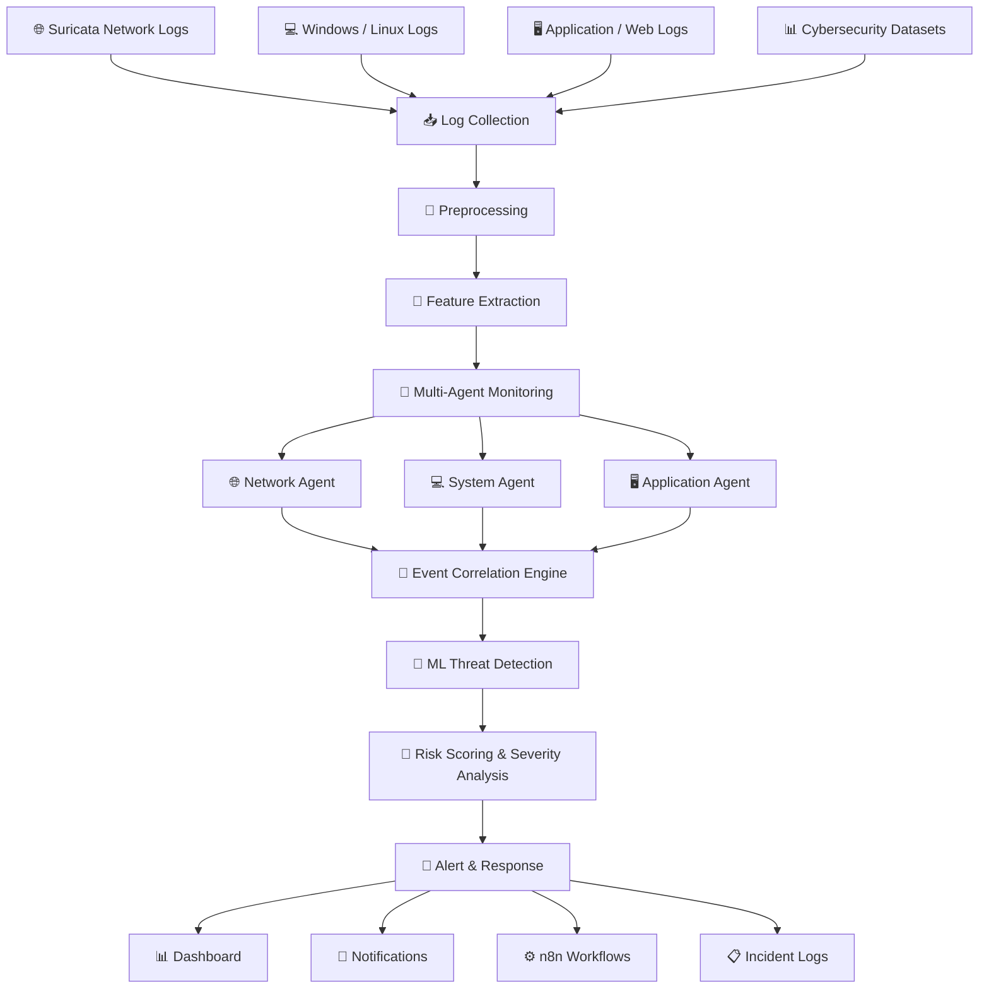
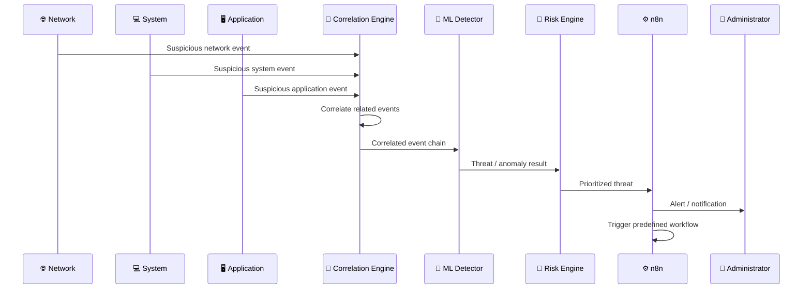

# 🛡️ AI-DRIVEN MULTI-AGENT SYSTEM FOR CYBER THREAT DETECTION

<p align="center">
  
  
  
  
  
  
</p>

<p align="center">
  <h3 align="center">Observe. Correlate. Detect. Prioritize. Respond.</h3>
</p>

<p align="center">
  A unified cybersecurity framework that combines <b>network, system, and application intelligence</b>
  through specialized monitoring agents, cross-source event correlation, lightweight machine learning,
  risk analysis, and automated response workflows.
</p>

---

## ⚡ THE IDEA IN ONE DIAGRAM

```text
                         ┌─────────────────────────────┐
                         │       DIGITAL ENVIRONMENT   │
                         └──────────────┬──────────────┘
                                        │
              ┌─────────────────────────┼─────────────────────────┐
              │                         │                         │
              ▼                         ▼                         ▼
       🌐 NETWORK LOGS             💻 SYSTEM LOGS            🖥️ APP LOGS
              │                         │                         │
              ▼                         ▼                         ▼
       ┌─────────────┐           ┌─────────────┐           ┌─────────────┐
       │   NETWORK   │           │   SYSTEM    │           │ APPLICATION │
       │    AGENT    │           │    AGENT    │           │    AGENT    │
       └──────┬──────┘           └──────┬──────┘           └──────┬──────┘
              │                         │                         │
              └─────────────────────────┼─────────────────────────┘
                                        ▼
                              🔗 EVENT CORRELATION
                                        │
                                        ▼
                              🧠 ML THREAT DETECTOR
                                        │
                                        ▼
                                 🎯 RISK ANALYSIS
                                        │
                                        ▼
                                   🚨 ALERTS
                                        │
                                        ▼
                               ⚙️ n8n AUTOMATION
                                        │
                                        ▼
                                 🛡️ RESPONSE
```

---

# 🚨 WHY THIS PROJECT?

A cyberattack is often a **sequence of related events**, not one obvious event.

For example:

```text
Failed Login Attempts
        ↓
Successful Authentication
        ↓
Privilege Escalation
        ↓
Abnormal Network Activity
        ↓
Suspicious Application Access
        ↓
             🚨
       POSSIBLE ATTACK CHAIN
```

If each event is inspected independently, the relationship between them can be missed.

This project approaches the problem differently:

> **Give each security layer its own monitoring agent, then bring their observations together to understand the attack sequence.**

---

# 🧠 PROJECT OVERVIEW

The **AI-Driven Multi-Agent System for Cyber Threat Detection** is designed to provide a unified platform for monitoring heterogeneous cybersecurity data.

The system:

- Collects network, system, and application logs
- Cleans and standardizes incoming events
- Extracts useful security features
- Assigns events to specialized monitoring agents
- Correlates suspicious activity across sources
- Applies lightweight machine-learning techniques
- Generates risk scores
- Prioritizes suspicious threats
- Produces real-time alerts
- Triggers automated response workflows
- Stores detected events and incident information

---

# 🏗️ ARCHITECTURE



---

# 🧩 THE SIX-LAYER SECURITY PIPELINE

```text
┌──────────────────────────────────────────────────────────────┐
│  01  INPUT LAYER                                             │
│      Network + System + Application + Datasets              │
├──────────────────────────────────────────────────────────────┤
│  02  PREPROCESSING LAYER                                     │
│      Cleaning + Normalization + Feature Extraction          │
├──────────────────────────────────────────────────────────────┤
│  03  MULTI-AGENT LAYER                                       │
│      Network Agent + System Agent + Application Agent       │
├──────────────────────────────────────────────────────────────┤
│  04  DECISION LAYER                                          │
│      Correlation + ML Detection + Risk Scoring              │
├──────────────────────────────────────────────────────────────┤
│  05  OUTPUT LAYER                                            │
│      Alerts + Dashboard + Notifications + Incident Logs     │
├──────────────────────────────────────────────────────────────┤
│  06  RESPONSE AUTOMATION                                     │
│      n8n Workflows + Predefined Security Actions            │
└──────────────────────────────────────────────────────────────┘
```

---

# 🤖 MULTI-AGENT INTELLIGENCE

## 🌐 NETWORK AGENT

The Network Agent focuses on network-level activity.

### Monitors

- Suspicious packets
- Abnormal traffic
- Intrusion attempts
- Port scanning
- Network anomalies

```text
NETWORK TRAFFIC
       ↓
NETWORK AGENT
       ↓
SUSPICIOUS EVENT
       ↓
CORRELATION ENGINE
```

---

## 💻 SYSTEM AGENT

The System Agent focuses on host and operating-system behaviour.

### Monitors

- Login attempts
- Repeated failed authentication
- Privilege escalation
- CPU usage anomalies
- Suspicious host activity

```text
SYSTEM EVENTS
       ↓
SYSTEM AGENT
       ↓
HOST BEHAVIOUR
       ↓
CORRELATION ENGINE
```

---

## 🖥️ APPLICATION AGENT

The Application Agent focuses on application and web-server activity.

### Monitors

- Unauthorized access
- Web attacks
- API misuse
- Abnormal user behaviour
- Application-level anomalies

```text
APPLICATION LOGS
       ↓
APPLICATION AGENT
       ↓
BEHAVIOUR ANALYSIS
       ↓
CORRELATION ENGINE
```

---

# 🔗 THE CORRELATION ENGINE

The correlation engine is the point where separate observations become a connected security picture.

### Example

```text
┌──────────────────┐
│ NETWORK AGENT    │
│ Port Scan        │
└────────┬─────────┘
         │
         ├────────────────────────┐
         │                        │
         ▼                        ▼
┌──────────────────┐      ┌──────────────────┐
│ SYSTEM AGENT     │      │ APPLICATION      │
│ Failed Logins    │      │ Suspicious API   │
└────────┬─────────┘      └────────┬─────────┘
         │                         │
         └────────────┬────────────┘
                      ▼
             🔗 CORRELATION
                      │
                      ▼
             POSSIBLE ATTACK
                  SEQUENCE
```

The report specifically describes a correlation example where:

```text
Repeated Failed Login Attempts
              +
Privilege Escalation
              ↓
     Possible Brute-Force Attack
```

---

# 🧠 THREAT DETECTION

The decision layer combines correlated events with machine-learning-based analysis.

The project design identifies lightweight approaches such as:

- Random Forest
- Isolation Forest

Conceptually:

```text
RAW EVENTS
    ↓
PREPROCESSING
    ↓
FEATURE EXTRACTION
    ↓
AGENT OBSERVATIONS
    ↓
EVENT CORRELATION
    ↓
ML ANALYSIS
    ↓
NORMAL / SUSPICIOUS
```

The lightweight approach is intended to keep computational requirements practical for continuous monitoring.

---

# 🎯 RISK SCORING

A detected event is not only identified — it can also be prioritized.

The project architecture considers:

```text
        ┌──────────────┐
        │   SEVERITY   │
        └──────┬───────┘
               │
               ▼
┌──────────┐  ┌──────────┐  ┌─────────────┐
│  IMPACT  │─►│   RISK   │◄─│ PROBABILITY │
└──────────┘  └────┬─────┘  └─────────────┘
                   │
                   ▼
            THREAT PRIORITY
```

This helps distinguish routine activity from events that require greater attention.

---

# 🚨 FROM DETECTION TO RESPONSE

The system is designed to continue beyond detection.

```text
DETECT
  ↓
CORRELATE
  ↓
CLASSIFY
  ↓
SCORE
  ↓
PRIORITIZE
  ↓
ALERT
  ↓
AUTOMATE
  ↓
RESPOND
  ↓
RECORD
```

Possible response actions described in the project design include:

- Blocking suspicious IP addresses
- Generating incident reports
- Isolating affected systems
- Sending administrator notifications
- Recording security incidents
- Triggering predefined workflows

---

# ⚙️ n8n AUTOMATION LAYER

n8n provides the workflow-automation layer.

```text
                🚨 THREAT DETECTED
                         │
                         ▼
                  ┌──────────────┐
                  │ n8n WORKFLOW │
                  └──────┬───────┘
                         │
          ┌──────────────┼──────────────┐
          ▼              ▼              ▼
      📧 ALERT       📋 REPORT       🛡️ ACTION
          │              │              │
          └──────────────┼──────────────┘
                         ▼
                  INCIDENT RECORD
```

This creates the project's central operational chain:

> **Detection → Decision → Automation → Response**

---

# 📥 DATA SOURCES

| Source | Purpose |
|---|---|
| 🌐 Suricata IDS | Network intrusion and traffic events |
| 💻 Windows / Linux | System and host activity |
| 🖥️ Application / Web Logs | Application access and behaviour |
| 📊 CICIDS2017 | Network intrusion analysis |
| 📊 UNSW-NB15 | Modern network attack detection |
| 📊 KDD Cup 99 | Anomaly / intrusion experiments |
| 🧪 Sample Logs | Testing and module evaluation |

---

# 🧹 PREPROCESSING PIPELINE

Raw security logs are transformed before analysis.

```text
RAW LOG
   ↓
Remove Duplicates
   ↓
Handle Missing Values
   ↓
Normalize Timestamps
   ↓
Parse Log Fields
   ↓
Extract Security Features
   ↓
STRUCTURED EVENT
```

Example feature categories include:

- IP address
- Protocol type
- Login activity
- Request frequency
- Event timestamp
- Suspicious activity indicators

---

# 🧪 DATASET REPOSITORY

The project report references a dedicated dataset repository:

```text
https://github.com/Greeshma-Sss/AI-Driven-Cyber-Threat-Detection-Dataset
```

The dataset repository contains representative data and references intended to support reproducibility and project evaluation.

---

# 🧰 TECHNOLOGY STACK

| Layer | Technology |
|---|---|
| 🐍 Backend / ML | Python 3.10 |
| 🛡️ Network IDS | Suricata |
| 📊 Data Processing | Pandas, NumPy |
| 🧠 Machine Learning | Scikit-learn |
| 🔎 Security Analytics | ELK Stack |
| 🖥️ Host Monitoring | Wazuh |
| ⚙️ Workflow Automation | n8n |
| 🗄️ Database | MongoDB / MySQL |
| 📊 Dashboard | Flask / Streamlit |
| 🛰️ Network Analysis | Wireshark |
| 🐧 Environment | Ubuntu |
| 📦 Virtualization | VirtualBox |
| ☁️ Cloud | AWS (optional) |
| 🔧 Version Control | Git / GitHub |

---

# 🔬 RESEARCH GAP

The project is motivated by a gap identified in the literature reviewed for the project.

Existing approaches commonly focus on areas such as:

```text
Log Anomaly Detection
        │
        ├── SIEM Correlation
        │
        ├── Intrusion Detection
        │
        ├── Deep Learning
        │
        └── Security Analytics
```

The project combines several of these capabilities into one architecture:

```text
┌───────────────────────────────────────┐
│       MULTI-AGENT MONITORING          │
├───────────────────────────────────────┤
│       CROSS-SOURCE CORRELATION        │
├───────────────────────────────────────┤
│       LIGHTWEIGHT ML DETECTION        │
├───────────────────────────────────────┤
│       RISK PRIORITIZATION             │
├───────────────────────────────────────┤
│       AUTOMATED RESPONSE              │
└───────────────────────────────────────┘
```

The intended outcome is improved visibility into coordinated attacks that may span multiple security layers.

---

# 🖥️ CONCEPTUAL SECURITY OPERATIONS VIEW

```text
╔══════════════════════════════════════════════════════════════╗
║                 🛡️ CYBER DEFENSE CONSOLE                   ║
╠══════════════════════════════════════════════════════════════╣
║                                                              ║
║   NETWORK AGENT        SYSTEM AGENT       APP AGENT          ║
║        ●                    ●                  ●              ║
║                                                              ║
║   ───────────────── LIVE EVENT STREAM ─────────────────      ║
║                                                              ║
║   10:31:02  Failed Login Burst                     MEDIUM    ║
║   10:31:04  Privilege Escalation                   HIGH      ║
║   10:31:06  Abnormal Network Traffic               HIGH      ║
║                                                              ║
║   ─────────────── CORRELATED ACTIVITY ────────────────      ║
║                                                              ║
║   Failed Login → Privilege Escalation → Network Anomaly     ║
║                              │                               ║
║                              ▼                               ║
║                       🚨 THREAT CHAIN                        ║
║                                                              ║
║   ─────────────────── RESPONSE ────────────────────────      ║
║                                                              ║
║   Alert ✓     Incident ✓     Workflow ✓     Response ✓      ║
║                                                              ║
╚══════════════════════════════════════════════════════════════╝
```

---

# 📋 FUNCTIONAL REQUIREMENTS

| ID | Requirement |
|---|---|
| FR1 | Collect logs from network, system, and application sources |
| FR2 | Preprocess raw log data before analysis |
| FR3 | Continuously monitor logs using multiple agents |
| FR4 | Correlate related events across multiple sources |
| FR5 | Detect anomalies using machine-learning techniques |
| FR6 | Generate alerts for suspicious activities |
| FR7 | Support automated response workflows |
| FR8 | Store detected events and results for future analysis |

---

# 🛡️ NON-FUNCTIONAL REQUIREMENTS

| ID | Requirement |
|---|---|
| NFR1 | Low-latency processing of incoming logs |
| NFR2 | Scalability for increasing log volume |
| NFR3 | Reliability during continuous monitoring |
| NFR4 | Secure handling of log data |
| NFR5 | User-friendly and maintainable architecture |
| NFR6 | Lightweight models with low computational cost |

---

# 📂 LOGICAL PROJECT STRUCTURE

```text
ai-driven-multi-agent-system-for-cyber-threat-detection/
│
├── agents/
│   ├── network/
│   ├── system/
│   └── application/
│
├── preprocessing/
│
├── feature_extraction/
│
├── correlation/
│
├── models/
│
├── alerting/
│
├── automation/
│   └── n8n/
│
├── dashboard/
│
├── data/
│
├── logs/
│
├── docs/
│
├── requirements.txt
├── README.md
└── LICENSE
```

> This is a logical representation of the architecture described in the project report. Keep the actual repository tree synchronized with the files present in the implementation.

---

# 🚀 SETUP

## 1. Clone

```bash
git clone https://github.com/Divyaprada-G/ai-driven-multi-agent-system-for-cyber-threat-detection.git
cd ai-driven-multi-agent-system-for-cyber-threat-detection
```

## 2. Create Environment

```bash
python -m venv venv
```

### Windows

```bash
venv\Scripts\activate
```

### Linux / macOS

```bash
source venv/bin/activate
```

## 3. Install Dependencies

```bash
pip install -r requirements.txt
```

## 4. Configure

Configure the security-data sources and services required by the implementation:

```text
Suricata
Windows / Linux Logs
Application Logs
ML Model
n8n
Dashboard / Storage
```

## 5. Run

Use the entry point provided by the current repository implementation.

For example, if applicable:

```bash
python app.py
```

or:

```bash
streamlit run dashboard/app.py
```

> These commands are examples only; use the actual entry-point files present in the repository.

---

# 🔄 COMPLETE ATTACK-TO-RESPONSE FLOW



---

# 🌍 REAL-WORLD USE CASES

### 🏢 Enterprise Security

Monitor security events across distributed systems.

### ☁️ Cloud Infrastructure

Aggregate security information from cloud and application environments.

### 🌐 Web Applications

Observe suspicious access, web attacks, and API misuse.

### 🏭 IoT Environments

Extend multi-agent monitoring toward connected-device networks.

### 🖥️ Security Operations

Provide correlated security information for investigation and response.

---

# 🔮 FUTURE ROADMAP

The project report identifies the following future directions:

```text
CURRENT FOUNDATION
        │
        ├──► 🧠 LSTM
        │
        ├──► 🧠 Autoencoders
        │
        ├──► 🧠 Transformers
        │
        ├──► ☁️ Cloud Deployment
        │
        ├──► 🌐 IoT Security
        │
        ├──► 🛰️ Threat Intelligence Feeds
        │
        ├──► 🧬 Adaptive / Zero-Day Detection
        │
        ├──► 📊 Advanced Dashboards
        │
        ├──► 🛡️ SOAR Integration
        │
        ├──► 🔥 Firewall Integration
        │
        └──► 📦 Distributed / Containerized Agents
```

---

# 📈 EVOLUTION OF THE SYSTEM

```text
                ┌─────────────────────┐
                │   RAW SECURITY DATA │
                └──────────┬──────────┘
                           ↓
                ┌─────────────────────┐
                │   MULTI-AGENT VIEW  │
                └──────────┬──────────┘
                           ↓
                ┌─────────────────────┐
                │   CORRELATED VIEW   │
                └──────────┬──────────┘
                           ↓
                ┌─────────────────────┐
                │   INTELLIGENT VIEW  │
                └──────────┬──────────┘
                           ↓
                ┌─────────────────────┐
                │   PRIORITIZED VIEW  │
                └──────────┬──────────┘
                           ↓
                ┌─────────────────────┐
                │   ACTIONABLE VIEW   │
                └─────────────────────┘
```

---

# 🎓 ACADEMIC PROJECT

| Field | Details |
|---|---|
| Project | AI Driven Multi-Agent System for Cyber Threat Detection |
| Program | B.E. Artificial Intelligence & Data Science |
| Semester | VI Semester |
| Batch ID | 58 |
| Institution | Siddaganga Institute of Technology |
| Department | Computer Science and Engineering |
| Domain | Artificial Intelligence + Cybersecurity |
| Primary Language | Python 3.10 |

---

# 👩‍💻 PROJECT TEAM

| Member | USN |
|---|---|
| Chaitra N | 1SI23AD009 |
| Greeshma S | 1SI23AD013 |
| PoojaPrakash | 1SI23AD036 |
| Divyapradha G | 1SI24AD401 |

### Guide

**Dr. Sumalatha Aradhya**  
Associate Professor  
Department of Computer Science and Engineering  
Siddaganga Institute of Technology

---

# 💰 PROJECT BUDGET

| Category | Estimated Cost |
|---|---:|
| Software | ₹0 |
| AWS | ₹9,000 |
| Optional Hardware | ₹4,500 |
| Documentation / Miscellaneous | ₹1,500 |
| **Total** | **₹15,000** |

---

# 🔐 RESPONSIBLE SECURITY

This project is intended for:

- Academic research
- Cybersecurity education
- Defensive monitoring
- Threat-detection experimentation
- Security analytics
- Authorized laboratory environments

Use the system only on infrastructure for which you have permission to monitor and test.

```text
AUTHORIZED ENVIRONMENT
        ↓
SECURITY MONITORING
        ↓
THREAT DETECTION
        ↓
DEFENSIVE RESPONSE
```

---

# 📚 RESEARCH REFERENCES

The project report's bibliography includes research covering:

- Log-correlation tools for cyberattack detection
- Online log anomaly detection
- Machine learning with Wazuh
- Adaptive AI intrusion detection
- Lightweight ML-enabled intrusion detection
- Deep-learning cyberattack event classification
- Hierarchical real-time intrusion detection
- Few-shot intrusion detection
- Cloud-based AI intrusion detection
- Hierarchical security event correlation
- Multi-layer SIEM correlation

---

# ⭐ PROJECT HIGHLIGHTS

```text
╔══════════════════════════════════════════════════════════╗
║                 🛡️ AI CYBER DEFENSE                     ║
╠══════════════════════════════════════════════════════════╣
║                                                          ║
║   🌐 NETWORK AGENT                                      ║
║              │                                           ║
║   💻 SYSTEM AGENT                                       ║
║              │                                           ║
║   🖥️ APPLICATION AGENT                                  ║
║              │                                           ║
║              ▼                                           ║
║      🔗 EVENT CORRELATION                               ║
║              │                                           ║
║              ▼                                           ║
║      🧠 ML THREAT DETECTION                             ║
║              │                                           ║
║              ▼                                           ║
║       🎯 RISK ANALYSIS                                  ║
║              │                                           ║
║              ▼                                           ║
║          🚨 ALERT                                       ║
║              │                                           ║
║              ▼                                           ║
║       ⚙️ AUTOMATION                                     ║
║              │                                           ║
║              ▼                                           ║
║          🛡️ RESPONSE                                    ║
║                                                          ║
╚══════════════════════════════════════════════════════════╝
```

---

# 🧠 THE CORE PRINCIPLE

### Don't analyze events only in isolation.

```text
EVENT
  ↓
CONTEXT
  ↓
RELATIONSHIP
  ↓
ATTACK PATTERN
  ↓
THREAT
  ↓
ACTION
```

The project's central concept is:

> **Multiple specialized agents observe different layers. Event correlation connects their observations. Machine learning helps analyze suspicious behaviour. Risk scoring prioritizes it. Automation helps turn detection into response.**

---

# 🏁 FINAL VISION

```text
OBSERVE
   ↓
UNDERSTAND
   ↓
CORRELATE
   ↓
DETECT
   ↓
PRIORITIZE
   ↓
ALERT
   ↓
RESPOND
```

### 🌐 One Environment
### 🤖 Multiple Specialized Agents
### 🔗 One Correlated Security View
### 🧠 AI-Assisted Threat Detection
### ⚙️ Automated Response

---

<p align="center">

## 🛡️ AI × MULTI-AGENT SYSTEMS × CYBERSECURITY

### Turning Security Events into Security Intelligence.

</p>

<p align="center">
Built as an academic cybersecurity project at Siddaganga Institute of Technology.
</p>

---

# 🔗 REPOSITORY

```text
https://github.com/Divyaprada-G/ai-driven-multi-agent-system-for-cyber-threat-detection
```
