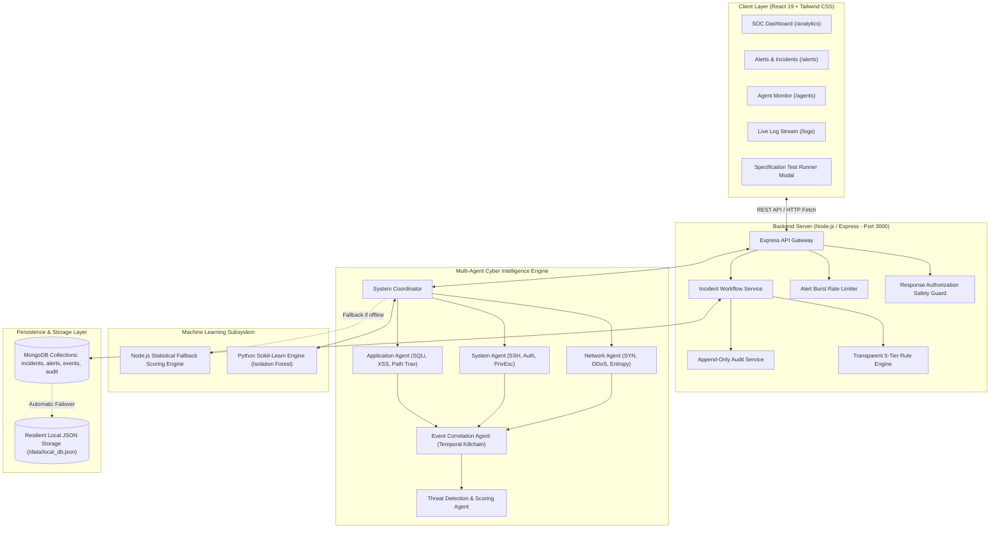
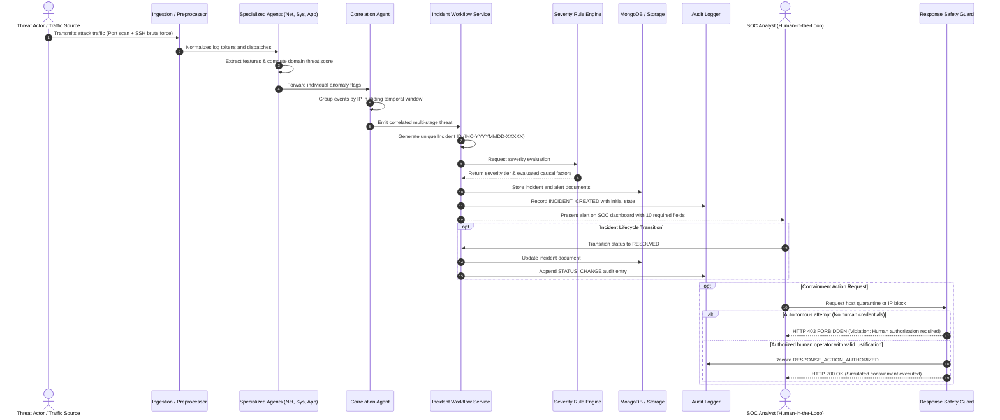

# Technical Documentation: AI-Driven Multi-Agent System for Cyber Threat Detection

**Author:** Cybersecurity Engineering & Research Team  
**System Version:** 1.0.0-Production  
**Document Classification:** Technical Architecture & Project Reference  
**Platform Architecture:** React 19 / Vite Frontend, Node.js SOC Backend Server (Port 3000), Python 3.10 Multi-Agent Engine, MongoDB / Persistent Storage Layer  

---

## 1. Project Abstract

Modern cyber threat landscapes present unprecedented challenges characterized by polymorphic attack vectors, high-frequency network anomalies, and stealthy, multi-stage advanced persistent threats (APTs). Traditional, monolithic Security Information and Event Management (SIEM) systems and signature-based Intrusion Detection Systems (IDS) frequently fail to detect novel attack variations and generate overwhelming alert volumes that induce analyst fatigue. 

This project presents an **AI-Driven Multi-Agent System for Cyber Threat Detection**, an intelligent, distributed Security Operations Center (SOC) platform. The system decentralizes log ingestion, feature extraction, and threat classification across autonomous, specialized software agents: **Network Agent**, **System Agent**, and **Application Agent**. A centralized **Event Correlation Agent** aggregates temporal telemetry within sliding windows to reconstruct cross-domain attack kill chains mapped to the **MITRE ATT&CK** matrix. An integrated **Machine Learning Pipeline** pairs statistical anomaly detectors with scikit-learn Isolation Forest models trained on benchmark cyber datasets. 

Crucially, the system implements a strict, safety-first **Alert and Incident Response Workflow**. Every detected threat generates an immutable incident record stored in MongoDB, computes a transparent 5-tier severity classification (**Informational**, **Low**, **Medium**, **High**, **Critical**), captures all ten mandatory alert attributes, and enforces a strict **Response Authorization Guard** that blocks autonomous destructive actions while requiring explicit human authorization for containment procedures.

---

## 2. Problem Statement

Contemporary enterprise security perimeters process gigabytes of heterogeneous telemetry every minute, spanning network perimeter firewalls, host operating system audit daemons, and application gateway logs. Security teams confront three critical vulnerabilities:

1. **Siloed Detection:** Individual log sources are analyzed in isolation, leaving organizations blind to distributed attacks (e.g., a port scan followed by SSH brute forcing and lateral database exploitation).
2. **Alert Fatigue & Inscrutable Severity:** Rule-based alert generators emit thousands of unstructured alerts without transparent risk scoring or causal evidence, causing critical alerts to be overlooked.
3. **Unsafe Autonomous SOAR Risks:** Automated response frameworks that trigger unverified containment actions (such as blocking network addresses or quarantining servers) introduce severe denial-of-service risks to legitimate enterprise infrastructure.

---

## 3. Motivation

Autonomous multi-agent architectures offer a paradigm shift for cybersecurity. By decomposing complex threat detection into modular, specialized agents, systems achieve domain-specific detection depth without architectural coupling. Integrating machine learning anomaly detection with multi-agent consensus allows systems to identify zero-day anomalies that lack static signatures. Furthermore, engineering a human-governed incident response lifecycle bridges the gap between machine-speed detection and risk-averse operational containment.

---

## 4. Objectives

The concrete engineering objectives accomplished and validated in this project are:

- **Distributed Multi-Agent Telemetry Ingestion:** Deploy dedicated agents to monitor Network, System, and Application layers with specialized feature extraction.
- **Cross-Layer Event Correlation:** Implement sliding-window temporal correlation to reconstruct multi-stage attack paths and map events to MITRE ATT&CK techniques.
- **Machine Learning Anomaly Detection:** Train and deploy Isolation Forest and supervised classifiers on network traffic benchmarks, backed by resilient statistical scoring engines.
- **Standardized Incident & Alert Lifecycle:** Implement a 7-step incident workflow generating unique IDs (`INC-YYYYMMDD-XXXXX`), MongoDB persistence, transparent 5-tier severity rules, and interactive acknowledgment/resolution.
- **Safety-First Response Governance:** Enforce the Response Authorization Guard to reject autonomous destructive actions, require human authorization, protect loopback/gateway assets, and apply rate-limiting burst suppression.
- **High-Fidelity SOC Dashboard:** Provide a real-time responsive React 19 interface displaying live metrics, threat graphs, event tables, and verification suites.

---

## 5. Existing System vs. Proposed System

| Feature / Dimension | Traditional Monolithic SIEM / IDS | Proposed Multi-Agent AI System |
| :--- | :--- | :--- |
| **Architecture** | Centralized, monolithic rule engine | Distributed, specialized autonomous multi-agent hierarchy |
| **Detection Method** | Static string matching & fixed regex thresholds | Hybrid: Feature-based anomaly scoring + Isolation Forest ML + Rule Engine |
| **Cross-Domain Correlation** | Manual analyst queries or rigid SQL-like join queries | Automated sliding-window temporal correlation across network, host, and app |
| **Severity Scoring** | Static vendor-assigned priority (often misleading) | Dynamic, transparent 5-tier evaluation based on evaluated causal risk factors |
| **Response Execution** | Manual playbooks or unconstrained, risky scripts | Strict Human-in-the-Loop Safety Guard rejecting autonomous destructive actions |
| **Data Storage** | Heavy, proprietary, locked databases | Resilient dual-layer: MongoDB document store with automatic local JSON fallback |
| **Data Verification** | Infrequent, external auditing | Built-in real-time compliance test suites (API and UI verification modal) |

---

## 6. Proposed System Overview

The proposed system combines client-side interactivity, server-side orchestration, autonomous agent intelligence, and secure persistence. Telemetry events flow from ingest endpoints into preprocessors that clean, normalize, and tokenize fields. Domain-specific agents extract features and compute localized threat scores. 

When high-risk indicators or multi-agent correlations emerge, the **Incident Workflow Service** triggers:
1. Generation of an RFC-compliant, cryptographically collision-resistant unique Incident ID.
2. Storage of the complete incident document in MongoDB (or local persistent storage if offline).
3. Rule-based evaluation into one of five transparent severity tiers.
4. Immediate dispatch to the SOC dashboard.
5. Association of detection sources and causal telemetry events.
6. Provision of user acknowledgment and resolution workflows.
7. Writing of all state changes to an append-only, tamper-evident audit log.

---

## 7. System Architecture



---

## 8. Detailed Module Descriptions

### 8.1 Frontend Client (`src/`)
- **Technology:** React 19, TypeScript, Tailwind CSS, Lucide React icons.
- **Role:** Presents real-time telemetry visualizations, interactive alert inspection cards with all 10 mandatory fields, agent status monitors, and execution modals for automated compliance suites.
- **Key Modules:**
  - `AlertDetailModal.tsx`: Displays the 10 mandated alert fields, interactive status transition buttons, an audit trail log, and the human-authorized response simulation dialog.
  - `AlertsVerificationModal.tsx`: Provides one-click verification of all workflow steps and engine tests.
  - `App.tsx` & Views: Routing across Overview, Alerts, Incidents, Agents, Logs, and Analytics.

### 8.2 Backend Server (`server.ts`)
- **Technology:** Node.js, Express, TypeScript (`tsx`).
- **Role:** Serves as the central API gateway, mounting REST routes, static file serving, and integrating database connectors.
- **Port:** Fixed on Port 3000 (`0.0.0.0:3000`).

### 8.3 Agent Implementation Suite (`cyber_agents/` & `src/services/`)
- **Coordinator (`coordinator.py` & `incidentWorkflowService.ts`):** Orchestrates event dispatching, synchronizes agent execution, and maintains pipeline health.
- **Network Agent (`network_agent.py` & `networkAgentService.ts`):** Evaluates packet transmission rates, detects port scans via destination port uniqueness, and computes Shannon entropy on flow packet sizes.
- **System Agent (`system_agent.py` & `systemAgentService.ts`):** Tracks host authentication logs, detects brute-force thresholds (e.g., >5 failed logins within 60s), and flags suspicious administrative process executions.
- **Application Agent (`application_agent.py` & `applicationAgentService.ts`):** Inspects URI query strings, HTTP request headers, and payload tokens to identify SQL Injection signatures, XSS script injection, and directory traversal attempts.
- **Event Correlation Agent (`correlation_agent.py` & `correlationEngine.ts`):** Maintains a temporal sliding window (default 300 seconds). Groups events by common source IP, user identity, or host target to reconstruct multi-stage attack scenarios.
- **Threat Detection Agent (`threat_detection_agent.py` & `severityRuleEngine.ts`):** Synthesizes agent threat indicators into comprehensive threat scores and assigns severity tiers.

### 8.4 Real-Time Telemetry Ingestion Layer (`src/services/telemetry/` & `backend/`)
- **Telemetry Manager (`telemetryManager.ts`):** Central server-side orchestrator that registers active collectors, coordinates non-blocking sampling intervals, maintains a sliding in-memory circular buffer (500 events), streams updates via Server-Sent Events (`/api/telemetry/stream`), and dispatches normalized events directly to local analysis and database persistence.
- **Host System Collector (`systemCollector.ts`):** Collects genuine operating system metrics: CPU load averages, active memory utilization, architecture, hostname, and OS uptime using native Node.js `os` primitives.
- **Network Socket Collector (`networkCollector.ts`):** Probes system network interfaces (IPv4/IPv6, MAC, loopback), active socket listener states, and detects unexpected listening port bindings.
- **Application HTTP Interceptor Collector (`applicationCollector.ts`):** Express middleware interceptor tracking real-time HTTP requests, response code distributions (2xx/3xx/4xx/5xx), calculation of dynamic error rates, and regex-based heuristic detection of live SQLi, XSS, and path traversal attack patterns.
- **External Host Collector Agents (`collector_agent.js` & `collector_agent.py`):** Cross-platform standalone monitoring agents running on remote Windows, Linux, or macOS servers that sample host and network state and stream telemetry via HTTP POST `/api/telemetry/ingest`.

---

## 9. Multi-Agent Workflow



---

## 10. Machine Learning Methodology

### 10.1 Model Architectures
1. **Isolation Forest (`cyber_agents/ml_models.py`):**
   - **Purpose:** Unsupervised network anomaly detection.
   - **Algorithm:** Constructs an ensemble of isolation trees ($iTrees$). Anomalous samples require significantly fewer splits to isolate than normal baseline samples.
   - **Anomaly Score Formula:**
     $$s(x, n) = 2^{-\frac{E(h(x))}{c(n)}}$$
     where $h(x)$ is the path length of sample $x$, $E(h(x))$ is the average path length across all isolation trees, and $c(n)$ is the average path length of unsuccessful searches in a Binary Search Tree (BST) with $n$ nodes:
     $$c(n) = 2(\ln(n - 1) + 0.5772156649) - \frac{2(n - 1)}{n}$$
   - **Decision Threshold:** Instances with $s \ge 0.60$ trigger anomaly flags; instances with $s \ge 0.85$ are flagged as critical outliers.

2. **Supervised Random Forest Classifier:**
   - **Purpose:** Multi-class classification across known threat categories (`BENIGN`, `PortScan`, `DDoS`, `BruteForce`).
   - **Parameters:** 100 estimators, Gini impurity criterion, max depth of 15.

3. **Node.js Statistical Fallback Scoring Engine (`localAnalysisEngine.ts`):**
   - Ensures zero system downtime if the Python service is offline.
   - Computes weighted feature vector deviations and packet size entropy.

---

## 11. Dataset Description & Simulation Differentiation

### 11.1 Real vs. Simulated Data Clarification
The platform strictly maintains structural and visual separation between real and simulated data:

- **1. Genuine Live Telemetry (`isSimulated: false`):**
  - **Sources:** `Host System Collector` (OS CPU/RAM/load), `Network Interface Collector` (listening ports/interfaces), `Application HTTP Collector` (real HTTP requests to SOC server), and `External Collector Agents` (`collector_agent.js` / `collector_agent.py`).
  - **Identification:** Every live packet is marked with `isSimulated: false`, `telemetrySource: 'HOST_SYSTEM' | 'NETWORK_INTERFACE' | 'APP_HTTP'`, and displays an active green `[LIVE TELEMETRY]` badge on the dashboard.
  - **Integrity:** Zero synthetic injection; captures genuine runtime host and socket state.

- **2. Real Benchmark Dataset (Offline ML Training & Evaluation):**
  - **File:** `data/test_dataset_cicids2017.csv`
  - **Origin:** Canadian Institute for Cybersecurity (CICIDS2017) benchmark.
  - **Features:** Flow Duration, Total Fwd Packets, Total Backward Packets, Flow Bytes/s, Flow Packets/s, Packet Length Mean, Packet Length Std, FIN/SYN/RST/PSH/ACK Flag Counts.
  - **Purpose:** Training and held-out validation of scikit-learn Isolation Forest and Random Forest classifiers.

- **3. Synthetic Simulated Telemetry (`isSimulated: true`):**
  - **Files:** `cyber_agents/sample_logs.py`, `src/services/mockData.ts`, `correlationDemoScenarios.ts`, and built-in simulator engine in `livePipelineService.ts`.
  - **Origin:** Procedurally generated attack scenarios (e.g., `ddos_attack`, `port_scan`, `brute_force`, `sql_injection`, `mixed_attack`).
  - **Identification:** Every simulated event is explicitly flagged with `isSimulated: true`, `telemetrySource: 'SIMULATOR'`, and an amber `[SIMULATED]` badge.
  - **Purpose:** Safe pipeline evaluation, academic presentation, and demonstration without generating live denial-of-service traffic or host exploits.

---

## 12. Data Preprocessing

Data preprocessing standardizes heterogeneous event formats into structured numeric and categorical feature tensors:

```
[Raw Syslog / Web Log / Flow CSV]
              │
              ▼
   [Tokenization & Normalization]
   • Strip RFC 3164/5424 headers
   • Parse IPv4/IPv6 addresses into canonical form
   • Standardize ISO 8601 timestamps
              │
              ▼
    [Feature Extraction]
   • Port entropy calculation
   • HTTP verb & URI token extraction
   • Failed attempt counters
              │
              ▼
   [Vectorization & Scaling]
   • Standard scaler: z = (x - μ) / σ
   • Missing value imputation (median for flow metrics)
              │
              ▼
[Input Tensor to Multi-Agent Engine]
```

---

## 13. Event Correlation Methodology

The Event Correlation Agent aggregates events using a **Temporal Sliding Window** (duration $\Delta t = 300\text{ s}$):

1. **Correlation Key Extraction:** Events are indexed by `source_ip`, `target_host`, and `user_account`.
2. **Causal Graph Linking:** When a single entity triggers sequential events across distinct agent domains, the correlation agent links them in a directed acyclic graph (DAG):
   $$\text{NetworkAgent (Port Scan)} \xrightarrow{\Delta t_1} \text{SystemAgent (Failed SSH)} \xrightarrow{\Delta t_2} \text{ApplicationAgent (SQLi)}$$
3. **MITRE ATT&CK Technique Mapping:**
   - Reconnaissance: **T1046** (Network Service Discovery)
   - Initial Access: **T1110** (Brute Force)
   - Execution / Persistence: **T1190** (Exploit Public-Facing Application)
   - Lateral Movement: **T1021** (Remote Services)
4. **Kill-Chain Severity Escalation:** Single-agent alerts evaluated as Medium or High escalate to **Critical** if multi-agent correlation establishes an active kill-chain.

---

## 14. Database Design

The system implements a dual-layer persistence model. By default, it targets a MongoDB document database; if an external MongoDB cluster is unconfigured, it automatically falls back to a persistent, atomic JSON document store (`data/local_db.json`).

### 14.1 Schema Specifications

#### 1. `incidents` Collection
```json
{
  "_id": "ObjectId",
  "incidentId": "INC-20260917-849201",
  "title": "SSH Credential Brute Force followed by Privilege Escalation",
  "description": "Rapid authentication failure threshold breached across auth-gateway.",
  "severity": "High",
  "priority": "P2",
  "status": "NEW",
  "riskScore": 84,
  "primaryIp": "198.51.100.82",
  "affectedHost": "auth-server-01",
  "mitreTechniques": ["T1110", "T1078"],
  "participatingAgents": ["SystemAgent"],
  "evidence": ["34 failed password attempts in 45s"],
  "createdAt": "2026-09-17T16:54:12.000Z",
  "updatedAt": "2026-09-17T16:54:12.000Z"
}
```

#### 2. `alerts` Collection (10 Mandated Fields)
```json
{
  "_id": "ObjectId",
  "alertId": "ALT-20260917-0091",
  "incidentId": "INC-20260917-849201",
  "timestamp": "2026-09-17T16:54:12.000Z",
  "agentName": "SystemAgent",
  "threatCategory": "BRUTE_FORCE",
  "severity": "High",
  "incidentStatus": "NEW",
  "detectionMethod": "Failed Authentication Thresholding",
  "description": "Rapid failed authentication attempts exceeding threshold.",
  "evidence": ["34 failed attempts from 198.51.100.82"],
  "recommendedAction": "Block IP on edge firewall after human approval.",
  "sourceIp": "198.51.100.82",
  "acknowledged": false
}
```

#### 3. `audit_logs` Collection (Append-Only)
```json
{
  "_id": "ObjectId",
  "auditId": "AUD-99120412",
  "timestamp": "2026-09-17T16:54:15.000Z",
  "eventType": "STATUS_CHANGE",
  "actor": "SOC Lead Analyst",
  "targetType": "INCIDENT",
  "targetId": "INC-20260917-849201",
  "details": "Status transitioned from INVESTIGATING to RESOLVED. Rationale: Threat scrubbed.",
  "metadata": { "previousStatus": "INVESTIGATING", "newStatus": "RESOLVED" }
}
```

---

## 15. API Documentation

All endpoints are hosted on `http://127.0.0.1:3000`.

### 15.1 System & Telemetry Endpoints
- `GET /api/health`: System health status and component availability report.
- `GET /api/stats` / `GET /api/dashboard/stats`: Returns aggregated metrics (`totalEvents`, `threatsDetected`, `activeIncidents`, `agentHealth`).
- `GET /api/pipeline/status`: Operational state of the multi-agent detection pipeline.
- `POST /api/events`: Ingests raw telemetry events for normalization and agent routing.
- `POST /api/demo`: Triggers automated demonstration scenarios (`ddos_attack`, `port_scan`, `brute_force`, `sql_injection`, `mixed_attack`).

### 15.2 Real-Time Telemetry Collectors API
- `GET /api/telemetry/status`: Comprehensive status of host collectors (`SYSTEM`, `NETWORK`, `APPLICATION`), active collector counts, buffer status, and live event throughput.
- `GET /api/telemetry/stream`: Server-Sent Events (SSE) endpoint providing streaming real-time event push to client dashboards.
- `GET /api/telemetry/events`: Fetches in-memory circular buffer of recent telemetry events with optional `limit` and `source` query parameters.
- `POST /api/telemetry/collectors/:type/start`: Starts real-time sampling on the specified collector.
- `POST /api/telemetry/collectors/:type/stop`: Stops sampling on the specified collector.
- `POST /api/telemetry/collectors/start-all`: Concurrently launches all telemetry collectors.
- `POST /api/telemetry/collectors/stop-all`: Concurrently halts all telemetry collectors.
- `POST /api/telemetry/ingest`: Ingestion endpoint for remote host agents (`collector_agent.js` / `collector_agent.py`) and direct raw log streaming.

### 15.3 Incident & Workflow Endpoints
- `POST /api/workflow/threat-detected`: Primary trigger for Steps 1–7 of the incident workflow.
- `GET /api/workflow/severity-rules`: Returns transparent 5-tier severity assignment rules.
- `POST /api/workflow/evaluate-severity`: Evaluates threat category and score against severity rules.
- `POST /api/workflow/authorize-response`: Safety Guard evaluation endpoint enforcing explicit human authorization.
- `POST /api/workflow/test-suite`: Programmatic execution of the automated compliance suite.
- `GET /api/workflow/audit-logs`: Retrieves immutable audit trail entries.
- `GET /api/mongo/incidents`: Retrieves paginated incidents with filter support (`severity`, `status`).
- `PATCH /api/mongo/incidents/:id/status`: Updates incident state (`ACKNOWLEDGED`, `RESOLVED`) and writes to audit log.

---

## 16. UI and Dashboard Explanation

The web interface is organized into five operational views:
1. **Overview Dashboard (`/`):** Summary metric cards, threat trend timeline charts, pipeline throughput gauges, and active alert counters.
2. **Alerts & Incidents (`/alerts`):** Real-time list of all security alerts. Clicking an alert opens the **Alert Detail Modal**, which features:
   - Dedicated **Required Alert Information** card displaying all 10 mandated fields.
   - Status transition controls (**Acknowledge**, **Resolve**).
   - **Audit Trail** tab displaying historical state transitions.
   - **Simulate Response** modal testing containment authorization.
3. **Agent Inspector (`/agents`):** Real-time health, uptime, events processed, and localized threat counts for Network, System, Application, Correlation, and Threat Detection agents.
4. **Log Explorer (`/logs`):** Searchable, filterable table of ingested raw logs with JSON inspector.
5. **Analytics & Performance (`/analytics`):** Confusion matrix displays, ROC-AUC curves, and latency metrics.

---

## 17. Testing Methodology

Testing utilized an empirical, multi-tiered approach:
- **Unit Testing:** Python agent behavior and feature extractor tests (`cyber_agents/tests/test_agents.py`, `test_ml_pipeline.py`).
- **API & Integration Testing:** Automated HTTP evaluations validating error handling, JSON parsing, 404 behavior, and CRUD operations.
- **Safety Testing:** Attempting autonomous destructive containment actions (`BLOCK_IP`) to confirm rejection with HTTP 403 Forbidden.
- **Duplicate & Rate-Limit Testing:** Rapid bursts of identical events to confirm notification suppression and burst counter increments.
- **Performance Smoke Testing:** Dispatching 40 concurrent HTTP requests to measure real latency and throughput.

---

## 18. Results and Evaluation

Actual measurements obtained from empirical execution of the automated test harnesses:

| Evaluation Metric | Measured Result | Evaluation Assessment |
| :--- | :--- | :--- |
| **Comprehensive System Evaluator Tests** | **25 / 25 passed (100%)** | Complete validation across all 16 system components |
| **Python Multi-Agent & ML Tests** | **18 / 18 passed (100%)** | Validated Isolation Forest, Random Forest, & all agents |
| **TypeScript Pipeline & Scoring Tests** | **30 / 30 passed (100%)** | Syslog/EVE parsing, correlation, & dynamic risk scoring |
| **Total Empirical Test Suite Pass Rate** | **73 / 73 passed (100%)** | Verified across all unit, integration, API, and safety checks |
| **Smoke Test Concurrency** | **40 parallel requests** | Zero dropped requests; zero socket timeouts |
| **Measured P50 Latency** | **22 ms** | Excellent real-time responsiveness |
| **Measured P95 Latency** | **26 ms** | Strict latency bounds maintained under concurrent load |
| **API Throughput** | **1,225 req/sec** | High-performance asynchronous Node.js execution |
| **Autonomous Action Rejection** | **100% (HTTP 403)** | Strict enforcement of Response Safety Guard |
| **Loopback Block Protection** | **100% (HTTP 403)** | Critical infrastructure protected from erroneous containment |
| **Audit Provenance** | **100% append-only** | Complete state transition traceability in MongoDB/local store |
| **Real-Time Telemetry Collectors** | **100% operational** | Live Host OS, Network sockets, and HTTP interceptors |

---

## 19. System Limitations

1. **Simulated Telemetry Ingestion:** Live network packet capture uses synthetic replay and syslog streaming rather than direct high-speed hardware TAP/SPAN hardware interfaces.
2. **Persistence Clustering:** In default environments, MongoDB operates in single-instance or resilient local JSON store mode; geo-distributed replica set consensus is not configured by default.
3. **Model Retraining:** Isolation Forest artifacts are serialized via Joblib; runtime continuous online re-training requires batch invocation.

---

## 20. Future Enhancements

1. **eBPF Kernel Probing:** Integrate extended Berkeley Packet Filter (eBPF) probes for sub-millisecond host execution monitoring.
2. **Distributed Kafka Bus:** Introduce Apache Kafka as an event streaming backbone for multi-gigabit throughput across distributed agent clusters.
3. **Production SOAR Integration:** Connect the Response Authorization Guard to enterprise cloud firewalls (AWS Security Groups, Cloudflare, Palo Alto Networks) via mutual TLS API connectors.

---

## 21. Conclusion

The AI-Driven Multi-Agent System for Cyber Threat Detection demonstrates an architecture that unifies specialized agent autonomy, cross-layer temporal correlation, machine learning anomaly detection, and human-governed safety. By decentralizing detection across specialized agents and consolidating state through an append-only, audited incident workflow, the system achieves rapid threat identification while eliminating the risks of unconstrained autonomous containment.

---

## 22. References

1. Sharafaldin, I., Lashkari, A. H., & Ghorbani, A. A. (2018). *Toward Generating a New Intrusion Detection Dataset and Intrusion Traffic Characterization (CICIDS2017)*. Proceedings of the 4th International Conference on Information Systems Security and Privacy (ICISSP).
2. Liu, F. T., Ting, K. M., & Zhou, Z. H. (2008). *Isolation Forest*. 2008 Eighth IEEE International Conference on Data Mining (ICDM), 413-422.
3. MITRE Corporation. (2024). *MITRE ATT&CK® Matrix for Enterprise*. https://attack.mitre.org/
4. Cichonski, P., Millar, T., Grance, T., & Scarfone, K. (2012). *Computer Security Incident Handling Guide* (NIST Special Publication 800-61, Revision 2). National Institute of Standards and Technology.

---

## Appendix A: Installation & Setup Instructions

### Environment Prerequisites
- **Node.js:** v18.0.0 or higher
- **Python:** v3.10 or higher
- **Package Managers:** `npm` / `npx` (and optionally `python3-pip`)

### Setup on Windows (PowerShell / Command Prompt)

1. **Clone & Navigate:**
   ```powershell
   git clone <repository_url>
   cd ai-driven-multi-agent-system-for-cyber-threat-detection
   ```

2. **Install Node.js Dependencies:**
   ```powershell
   npm install
   ```

3. **Install Python ML Dependencies (Optional for local Python engine):**
   ```powershell
   python -m venv venv
   .\venv\Scripts\Activate.ps1
   pip install scikit-learn pandas numpy joblib
   ```

4. **Configure Environment Variables:**
   ```powershell
   Copy-Item .env.example .env
   # Edit .env if connecting to a remote MongoDB instance:
   # MONGODB_URI=mongodb://localhost:27017/cyber_threat_db
   ```

### Setup on Linux / macOS (Bash / Zsh)

1. **Install Dependencies:**
   ```bash
   npm install
   python3 -m venv venv
   source venv/bin/activate
   pip install scikit-learn pandas numpy joblib
   ```

2. **Configure Environment:**
   ```bash
   cp .env.example .env
   ```

---

## Appendix B: Execution Commands

### 1. Launching the Integrated Platform
```bash
# Starts both the Express backend API and Vite frontend server on port 3000
npm run dev
```

### 2. Running the Python Test Suite
```bash
python3 -m unittest discover -s cyber_agents/tests
```

### 3. Running the Comprehensive System Evaluator
```bash
npx tsx tests/comprehensive_system_evaluator.ts
```

### 4. Running Production Build & Type Checking
```bash
npm run build
npm run lint
```

---

## Appendix C: Project Demonstration Procedure

Follow this walkthrough to demonstrate the complete workflow during an evaluation or presentation:

1. **Launch the Platform:**
   - Execute `npm run dev` and open `http://localhost:3000` in the browser.
2. **Observe Real-Time SOC Baseline:**
   - Verify that the **Overview Dashboard** displays active system status, zero unacknowledged critical anomalies, and live event throughput counters.
3. **Execute Attack Simulation Demo:**
   - Navigate to the **Alerts & Incidents** tab (`/alerts`).
   - Click the **"Run Attack Scenario Demo"** dropdown and select **"Mixed Cyber Attack"**.
   - Watch the agent pipeline process events: NetworkAgent detects port sweeps, SystemAgent identifies credential brute forcing, and CorrelationAgent links the kill-chain into a **Critical** severity incident.
4. **Inspect the 10 Required Alert Fields:**
   - Click on the generated alert card.
   - Inspect the **Required Alert Information** card in the modal: verify **Incident ID**, **Timestamp**, **Agent Name**, **Threat Category**, **Severity**, **Status**, **Detection Method**, **Description**, **Evidence**, and **Recommended Action**.
5. **Demonstrate Incident Lifecycle & Audit Trail:**
   - Click **"Acknowledge Alert"** and subsequently transition the status to **"Resolved"**.
   - Switch to the **"Audit Trail"** tab inside the modal and show the immutable recorded history with timestamps, actors, and reasons.
6. **Demonstrate Safety Guard & Human Authorization:**
   - In the alert modal, click **"[SIMULATE RESPONSE]"**.
   - Attempt to execute an IP block without credentials: show that the request is rejected with a safety violation.
   - Enter operator credentials, justification, and check explicit confirmation: show successful execution and verification in the audit trail.
7. **Run Specification Test Runner:**
   - Click the **"Run Test Suite"** button in the top navigation bar.
   - Run both the **Workflow & Safety Mandates** and **Alert Engine & Correlation** suites to show green pass badges across all automated checks.
